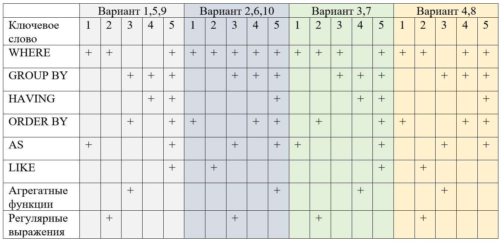

# Базы данных

## Лабораторная работа № 2. Оператор SELECT языка SQL

- [Теоретическая часть](#теоретическая-часть)
  - [Фильтрация строк](#фильтрация-строк)
  - [Условия отбора строк](#условия-отбора-строк)
  - [Проверка на уленство во множестве](#проверка-на-уленство-во-множестве)
  - [Поиск с использованием шаблона](#поиск-с-использованием-шаблона)
  - [Вычисляемые столбцы](#вычисляемые-столбцы)
  - [Агрегирование и группировка](#агрегирование-и-группировка)
  - [Сортировка](#сортировка)
  - [Оконные функции](#оконные-функции)
  - [Несколько важных замечаний](#несколько-важных-замечаний)
    - [Экранирование кавычек](#экранирование-кавычек)
    - [Типы данных в PostgreSQL](#типы-данных-в-postgresql)
    - [Преобразование типов](#преобразование-типов)
- [Практическая часть](#практическая-часть)
  - [Задание 1](#задание-1)
  - [Задание 2](#задание-2)
  - [Задание 3](#задание-3)
  - [Задание 4](#задание-4)
  - [Задание 5](#задание-5)


### Теоретическая часть

Основой работы с базами данных является умение правильно составить запрос на фильтрацию данных. Для данной задачи используется оператор `SELECT`. Ниже представлен сокращенный синтаксис данного оператора. Более подробно можно прочитать в [документации]().    

```sql
SELECT [ ALL | DISTINCT [ ON ( выражение [, ...] ) ] ]
    [ * | выражение [ [ AS ] имя_результата ] [, ...] ]
    [ FROM элемент_FROM [, ...] ]
    [ WHERE условие ]
    [ GROUP BY элемент_группирования [, ...] ]
    [ HAVING условие ]
    [ { UNION | INTERSECT | EXCEPT } [ ALL | DISTINCT ] выборка ]
    [ ORDER BY выражение [ ASC | DESC | USING оператор ] ]
    [ LIMIT { число | ALL } ]
    [ OFFSET начало [ ROW | ROWS ] ]
```

Оператор `SELECT` получает строки из базы данных и возвращает их в виде таблицы результатов запроса. Результат выполнения запроса может оказаться пустым множеством.   
Рассмотрим выполнение SQL запроса на фильтрацию данных по шагам.   

#### Фильтрация строк  

Первыми и обязательными элементами запроса являются ключевые слова `SELECT` и `FROM`. После ключевого слова `SELECT` указывается список столбцов, значения которых необходимо вывести. Возвращаемые столбцы могут быть получены непосредственно из базы данных или вычислены во время выполнения запроса. Для краткого обозначения того, что необходимо вывести все столбцы таблицы используют символ `*`.   

После ключевого слова `FROM` указывается имя таблицы, из которой будет производиться выборка данных. Данная таблица может быть реальной таблицей из базы данных, или виртуальной, полученной в результате подзапроса.   

```sql
SELECT * FROM student;
```

| student_id | surname   | name   | patronymic    | students_group_number | birthday   | email                 |
|------------|-----------|--------|---------------|-----------------------|------------|-----------------------|
| 838389     | Иванова   | Есения | Ивановна      | ИБ-21                 | 2003-12-23 | IvanovaEsenija@miet.ru|
| 822557     | Федоров   | Роберт | Даниилович    | ИБ-21                 | 2003-12-01 | FedorovRobert@miet.ru |
| 820564     | Морозов   | Илья   | Глебович      | ИБ-21                 | 2003-08-17 | MorozovIlja@miet.ru   |
| 830220     | Жилин     | Никита | Максимович    | ИБ-21                 | 2003-04-03 | ZhilinNikita@miet.ru  |
| 832502     | Худяков   | Андрей | Львович       | ИБ-21                 | 2003-01-05 | HudjakovAndrej@miet.ru|
| 850203     | Плотников | Марк   | Арсентьевич   | ИБ-21                 | 2003-04-11 | PlotnikovMark@miet.ru |
| 832928     | Максимов  | Виктор | Фёдорович     | ИБ-21                 | 2003-07-11 | MaksimovViktor@miet.ru|
| 856305     | Баранов   | Максим | Маркович      | ИБ-21                 | 2003-09-11 | BaranovMaksim@miet.ru |


Данный запрос возвращает список всех студентов университета. Для того, чтобы вывести только ФИО студентов, необходимо вместо знака `*` указать названия требуемых полей.   

```sql
SELECT surname, name, patronymic FROM student;
```

| surname   | name   | patronymic    |
|-----------|--------|---------------|
| Иванова   | Есения | Ивановна      |
| Федоров   | Роберт | Даниилович    |
| Морозов   | Илья   | Глебович      |
| Жилин     | Никита | Максимович    |
| Худяков   | Андрей | Львович       |
| Плотников | Марк   | Арсентьевич   |
| Максимов  | Виктор | Фёдорович     |
| Баранов   | Максим | Маркович      |

Следующий запрос   
```sql 
SELECT name FROM student;
```
Выведет все имена студентов, с учетом повторений. Чтобы их исключить необходимо использовать ключевое слово `DISTINCT`.   

```sql
SELECT DISTINCT name FROM student;
```

#### Условия отбора строк

Для наложения условий поиска используется оператор `WHERE`. В качестве операторов сравнения используются операторы: `=`, `<>`, `>`, `>=`, `<`, `<=`.   

Например, чтобы найти всех студентов с именем «Сергей», возможно выполнить следующий запрос:   

```sql
SELECT surname, name, patronymic FROM student WHERE name = 'Сергей';
```

| surname  | name   | patronymic      |
|----------|--------|-----------------|
| Дорофеев | Сергей | Евгеньевич      |
| Соловьев | Сергей | Владимирович    |


Обратите внимание, что сравниваемая строка заключается в одинарные кавычки. Об их использовании подробнее будет рассказано ниже.    

Аналогично можно найти всех студентов, у которых номер студенческого билета больше числа 850000.

```sql
SELECT surname, name, patronymic FROM student WHERE student_id > 850000;
``` 

| surname   | name    | patronymic    |
|-----------|---------|---------------|
| Плотников | Марк    | Арсентьевич   |
| Баранов   | Максим  | Маркович      |
| Носов     | Иван    | Глебович      |
| Николаев  | Андрей  | Матвеевич     |
| Николаев  | Алексей | Серафимович   |


Для наложения нескольких условий возможно воспользоваться логическими операторами – `AND`, `OR`, `NOT`.  

Например, следующий запрос вернет ФИО студентов, чей день рождения попадает в диапазон с 25 июня 2002 до 25 июня 2003 года включительно.   

```sql
SELECT surname, name, patronymic FROM student WHERE birthday > '25/06/2002' AND birthday < '25/06/2003';
```

| surname   | name   | patronymic    |
|-----------|--------|---------------|
| Жилин     | Никита | Максимович    |
| Худяков   | Андрей | Львович       |
| Плотников | Марк   | Арсентьевич   |
| Носов     | Иван   | Глебович      |
| Николаев  | Андрей | Матвеевич     |
| Григорьев | Даниил | Иванович      |
| Абрамов   | Платон | Степанович    |
| Зыков     | Фёдор  | Матвеевич     |


Аналогичный запрос можно сделать, используя ключевое слово `BETWEEN`  

```sql
SELECT surname, name, patronymic FROM student WHERE birthday BETWEEN '25/06/2002' AND '25/06/2003';
```

#### Проверка на уленство во множестве

С помощью ключевого слова `IN` возможно отобрать только те кортежи, заданный атрибут которых находится в указанном списке.   

Например, следующий запрос выводит список студентов, кто родился 23 ноября 2002 года или 09 февраля 2003 года.   

```sql
SELECT surname, name, patronymic FROM student WHERE birthday IN ('23/11/2001', '20/09/2001');
```

| surname  | name       | patronymic  |
|----------|------------|-------------|
| Романов  | Егор       | Глебович    |
| Касаткин | Константин | Миронович   |
| Алешин   | Дамир      | Эмирович    |


#### Поиск с использованием шаблона

Для наложения более сложных условий поиска возможно воспользоваться оператором поиска шаблонов `LIKE` и регулярными выражениями.   

```sql
строка LIKE шаблон [ESCAPE спецсимвол]
строка NOT LIKE шаблон [ESCAPE спецсимвол]
```

Оператор `LIKE` сравнивает анализируемую строку с заданным шаблоном и в случае совпадения отбирает эту строку. Для построения шаблона используются следующие спецсимволы:   

* `%` - любая последовательность символов
* `_` - строго один символ

Регулярные выражения POSIX   

* `^` - начало строки
* `$` - окончание строки
* `*` - повторение предыдущего символа любое число раз
* `\` - проверка наличия указанного после \ символа
* `|` - выбор одного из двух вариантов
* `~` - поиск с учетом регистра
* `[...]` - указание класса символов

При проверке по шаблону `LIKE` всегда рассматривается вся строка. Поэтому, если нужно найти последовательность символов где-то в середине строки, шаблон должен начинаться и заканчиваться знаками процента.   

Например, данный запрос позволяет найти всех студентов, чье имя начинается на букву ‘А’.   

```sql
SELECT surname, name, patronymic FROM student WHERE name LIKE 'А%'; 
```

| surname   | name       | patronymic  |
|-----------|------------|-------------|
| Худяков   | Андрей     | Львович     |
| Николаев  | Андрей     | Матвеевич   |
| Сычев     | Артём      | Артёмович   |
| Николаев  | Алексей    | Серафимович |
| Кузьмин   | Али        | Лукич       |
| Воронин   | Андрей     | Петрович    |
| Иванов    | Артём      | Маркович    |
| Алехин    | Андрей     | Всеволодович|

Данный запрос вернет всех студентов, чье имя состоит из 5 символов и заканчивается на букву "я".   

```sql
SELECT surname, name, patronymic FROM student WHERE name LIKE '____я';
```

| surname   | name       | patronymic  |
|-----------|------------|-------------|
| Кондрашова| Дарья      | Михайловна  |
| Коровина  | Мария      | Георгиевна  |
| Петрова   | София      | Николаевна  |
| Князева   | Лилия      | Тимофеевна  |
| Алехина   | Дарья      | Артёмовна   |
| Соколова  | Мария      | Романовна   |


Рассмотрим пример с регулярными выражениями   

```sql
SELECT surname, name, patronymic FROM student WHERE surname ~ '^[ЛМН]';
```

| surname   | name       | patronymic      |
|-----------|------------|-----------------|
| Морозов   | Илья       | Глебович        |
| Максимов  | Виктор     | Фёдорович       |
| Носов     | Иван       | Глебович        |
| Николаев  | Андрей     | Матвеевич       |
| Николаев  | Алексей    | Серафимович     |
| Малышев   | Глеб       | Гордеевич       |
| Литвинов  | Иван       | Александрович   |
| Маслов    | Михаил     | Дмитриевич      |


Данный пример вернет всех студентов, чьи фамилии начинаются на буквы Л, М, Н. Символом ^ обозначается, что следующий символ будет первым в строке. В квадратных скобках указывается список допустимых символов. Аналогично можно записать через диапазон – [Л-Н]. Символ `~` указывает, что сравнение идет с учетом регистров.   

Дополним выражение таким образом, чтобы отбираемые строки оканчивались на буквосочетание `ин`.

```sql
SELECT surname, name, patronymic FROM student WHERE surname ~ '^[ЛМН].*ин$';
```

| surname   | name       | patronymic  |
|-----------|------------|-------------|
| Маркин    | Даниэль    | Ильич       |
| Мухин     | Ростислав  | Янович      |


Символом `$` указывается, что предыдущие символы будут стоять в конце строки. Т.к. между ними и начальными символами могут находиться еще любое число символов, то обозначим их с помощью ‘.*’. В данном случае точка обозначает «любой символ», а звездочка продублирует его от 0 до любого числа раз.   

Если убрать символ окончания строки `$`, то будет производиться поиск строк, начинающихся на буквы Л, М, Н и содержащие в себе «ин».   

```sql
SELECT surname, name, patronymic FROM student WHERE surname ~ '^[ЛМН].*ин';
```

| surname   | name       | patronymic      |
|-----------|------------|-----------------|
| Литвинов  | Иван       | Александрович   |
| Литвинов  | Георгий    | Артёмович       |
| Маркин    | Даниэль    | Ильич           |
| Мухин     | Ростислав  | Янович          |


#### Вычисляемые столбцы  

На языке SQL возможно добавлять к итоговой выборке отдельные столбцы, значения которых будут вычисляться в процессе фильтрации. Для этого, к отбираемым столбцам после ключевого слова `SELECT` добавляется выражение, которое будет вычисляться для каждой строки.   

Например, рассчитаем возраст всех студентов вуза и выведем его вместе с ФИО. Для этого добавим еще один столбец и укажем в нем функцию age, позволяющую  вычислить разницу между двумя датами. В качестве точки отсчета выберем текущую дату, значение которой можно получить с помощью функции `CURRENT_DATE`.   

```sql
SELECT surname, name, patronymic, age(CURRENT_DATE, birthday) FROM student;
```

|   surname    |    name    |   patronymic   |           age            |
|--------------|------------|----------------|--------------------------|
| Иванова      | Есения     | Ивановна       | 19 years 6 mons 5 days   |
| Федоров      | Роберт     | Даниилович     | 19 years 6 mons 27 days  |
| Морозов      | Илья       | Глебович       | 19 years 10 mons 11 days |
| Жилин        | Никита     | Максимович     | 20 years 2 mons 25 days  |
| Худяков      | Андрей     | Львович        | 20 years 5 mons 23 days  |
| Плотников    | Марк       | Арсентьевич    | 20 years 2 mons 17 days  |
| Максимов     | Виктор     | Фёдорович      | 19 years 11 mons 17 days |
| Баранов      | Максим     | Маркович       | 19 years 9 mons 17 days  |


Для того, чтобы переименовать столбец age, воспользуемся ключевым словом `AS`. После него укажем новое название столбца – «Возраст».   

```sql
SELECT surname, name, patronymic, age(CURRENT_DATE, birthday) AS "Возраст" FROM student;
```

|   surname    |    name    |   patronymic   |         Возраст          |
|--------------|------------|----------------|--------------------------|
| Иванова      | Есения     | Ивановна       | 19 years 6 mons 5 days   |
| Федоров      | Роберт     | Даниилович     | 19 years 6 mons 27 days  |
| Морозов      | Илья       | Глебович       | 19 years 10 mons 11 days |
| Жилин        | Никита     | Максимович     | 20 years 2 mons 25 days  |
| Худяков      | Андрей     | Львович        | 20 years 5 mons 23 days  |
| Плотников    | Марк       | Арсентьевич    | 20 years 2 mons 17 days  |
| Максимов     | Виктор     | Фёдорович      | 19 years 11 mons 17 days |
| Баранов      | Максим     | Маркович       | 19 years 9 mons 17 days  |


#### Агрегирование и группировка

Для проведения статистических вычислений в SQL существуют агрегатные функции. Данные функции принимают на вход множество значений и возвращают одно.  

Основные агрегатные функции:
* `AVG`: находит среднее значение
* `COUNT(*)`: находит количество строк в запросе
* `SUM`: находит сумму значений
* `MIN`: находит наxsименьшее значение
* `MAX`: находит наибольшее значение

Например, в данном примере рассчитывается средний оклад всех преподавателей вуза. Т.к. атрибут «Оклад» имеет тип money, то для применения агрегатной функции необходимо привести его к числовому значению. Для этого используется конструкция `::numeric`.   

```sql
SELECT AVG(salary::numeric)::numeric(10,2) AS "Average salary" FROM professor;
```

```sql
SELECT SUM(wage_rate) AS "Общее число ставок" FROM employment;
```

Однако, если потребуется рассчитать общее число ставок для каждого из направлений, то такой подход не сработает. Перед тем, как применять агрегирующую функцию необходимо сгруппировать кортежи по определенному признаку – в данном примере, по номеру направления. Затем необходимо применить функцию `SUM` к каждой из получившихся групп.    

Для группировки строк в SQL служит оператор GROUP BY. Данный оператор распределяет строки, образованные в результате запроса по группам, в которых значения некоторого столбца, по которому происходит группировка, являются одинаковыми. Группировку можно производить как по одному столбцу, так и по нескольким.   

Дополним запрос из предыдущего примера. В данном случае сумма будет рассчитана для каждого структурного подразделения. В подразделении 1 работают три преподавателя – поэтому их ставки просуммировались и результатом стало значение 1.00.    

```sql
SELECT structural_unit_number AS "Structural unit number", SUM(wage_rate) AS "Wage rate sum" FROM Employment GROUP BY structural_unit_number;
```

| Structural unit number | Wage rate sum |
|------------------------|---------------|
|                      9 |          1.00 |
|                      3 |          2.40 |
|                      5 |          2.80 |
|                      4 |          2.25 |
|                      6 |          1.50 |
|                      2 |          1.50 |
|                      7 |          1.00 |
|                      1 |          5.15 |
|                      8 |          1.00 |


Рассмотрим еще один пример. В нем происходит подсчет числа сотрудников в каждом структурном подразделении.    

```sql
SELECT structural_unit_number AS "Structural unit number", count(*) AS "Number of employees" FROM employment GROUP BY structural_unit_number;
```

| Structural unit number | Number of employees |
|------------------------|---------------------|
|                      9 |                   2 |
|                      3 |                   4 |
|                      5 |                   5 |
|                      4 |                   9 |
|                      6 |                   3 |
|                      2 |                   6 |
|                      7 |                   2 |
|                      1 |                   9 |
|                      8 |                   2 |


Для фильтрации строк перед группировкой использовалось ключевое слово `WHERE`. В случае, если нужно отфильтровать строки после неё – используется ключевое слово `HAVING`. 

Добавим в приведенный выше пример условие, чтобы число сотрудников выводилось только для подразделений, в которых более 2х преподавателей.  

```sql
SELECT structural_unit_number AS "Structural unit number", count(*) AS "Number of employees" FROM employment GROUP BY structural_unit_number HAVING count(*) > 2;
```

| Structural unit number | Number of employees |
|------------------------|---------------------|
|                      3 |                   4 |
|                      5 |                   5 |
|                      4 |                   9 |
|                      6 |                   3 |
|                      2 |                   6 |
|                      1 |                   9 |

#### Сортировка

Для сортировки результата запроса необходимо использовать ключевое слово ORDER BY. После него указывается атрибуты, по которым производится сортировка. Далее указывается порядок с помощью слов `DESC` (в порядке убывания) и `ASC` (в порядке возрастания). По умолчанию строки сортируются по возрастанию, поэтому `ASC` можно опускать.   

```sql
SELECT structural_unit_number AS "Номер структурного подразделения", coun (*) AS "Число сотрудников" FROM employment GROUP BY structural_unit_number ORDER BY structural_unit_number;
```

| Номер структурного подразделения | Число сотрудников |
|---------------------------------|-------------------|
|                               1 |                 9 |
|                               2 |                 6 |
|                               3 |                 4 |
|                               4 |                 9 |
|                               5 |                 5 |
|                               6 |                 3 |
|                               7 |                 2 |
|                               8 |                 2 |
|                               9 |                 2 |


```sql
SELECT structural_unit_number AS "Номер структурного подразделения", coun (*) AS "Число сотрудников" FROM employment GROUP BY structural_unit_number ORDER BY structural_unit_number DESC;
```

| Номер структурного подразделения | Число сотрудников |
|---------------------------------|-------------------|
|                               9 |                 2 |
|                               8 |                 2 |
|                               7 |                 2 |
|                               6 |                 3 |
|                               5 |                 5 |
|                               4 |                 9 |
|                               3 |                 4 |
|                               2 |                 6 |
|                               1 |                 9 |


#### Оконные функции

При составлении запросов с использованием агрегирующих функций применялась группировка. Все строки с одинаковыми значениями, указанными после `GROUP BY` объединялись в одну и над каждой из данных групп совершалось определенное действие. Таким образом, число строк в результирующей таблице уменьшалось. Однако в некоторых случаях бывает полезным провести вычисления над группой и добавить вычисленное значение в качестве дополнительного столбца для каждой строки таблицы. Например, необходимо вывести студентов всех групп и пронумеровать в алфавитном порядке внутри каждой группы.  Для этого можно воспользоваться оконными функциями.   

В общем виде оконные функции выглядят следующим образом:   

```sql
SELECT
Название функции (столбец для вычислений) 
OVER (
        PARTITION BY столбец для группировки
        ORDER BY столбец для сортировки
)
```

В качестве функции может выступать одна из агрегатных функций (`SUM, COUNT, AVG, MIN, MAX`) или специальные функции, предназначенные для оконных вычислений.    

Приведем некоторые из них:   

* **ROW_NUMBER** – данная функция возвращает номер строки и используется для нумерации;
* **FIRST_VALUE** или **LAST_VALUE** — с помощью функции можно получить первое и последнее значение в окне. В качестве параметра принимает столбец, значение которого необходимо вернуть;
* **CUME_DIST** — вычисляет интегральное распределение (относительное положение) значений в окне;

После ключевых слов `PARTITION BY` необходимо указать поле, по которому будет производиться объединение в группы. Далее возможно отсортировать значения внутри каждой из групп.    

В итоге запрос для вычисления порядкового номера студента будет выглядеть следующим образом:    

```sql
SELECT row_number() OVER (partition by students_group_number ORDER BY student.surname), surname, name, patronymic FROM student;
```

Рассмотрим еще один пример, где каждому студенту добавляется поле, содержащее средний балл всей группы.    

```sql
SELECT DISTINCT	
	surname, 
	name, 
	patronymic, 
	avg(field_comprehension.mark) OVER(partition by students_group_number)::numeric(8,2), 
	student.students_group_number FROM student INNER JOIN field_comprehension ON field_comprehension.student_id = student.student_id;
```

#### Несколько важных замечаний

##### Экранирование кавычек

При использовании текстовых строк в запросах их необходимо обрамлять одинарными кавычками. Как, например, в следующем запросе:   

```sql
SELECT surname, name FROM student WHERE name = 'Анна';
```

Данный запрос выполнен не будет, т.к. СУБД распознает как строку только символ 'O'. Чтобы одинарная кавычка воспринималась как часть строки, а не указание на её окончание, в PostgreSQL предусмотрена возможность дублирования данной кавычки.   

```sql
SELECT surname, name FROM student WHERE surname = 'O''Brien' 
```

Способ, указанный выше, сработает.   

##### Типы данных в PostgreSQL

PostgreSQL предоставляет пользователям большой выбор встроенных типов данных. Ниже приведены основные из них. Более подробно можно прочитать в Главе 8 документации PostgreSQL.   


* **bigint** - знаковое целое из 8 байт
* **boolean** - логическое значение (true/false)
* **date** - календарная дата (год, месяц, день)
* **integer** - знаковое четырёхбайтное целое
* **json** - текстовые данные JSON
* **money** - денежная сумма
* **numeric [ (p, s) ]** - вещественное число заданной точности
* **real** - число одинарной точности с плавающей точкой (4 байта)
* **smallint** - знаковое двухбайтное целое
* **serial** - четырёхбайтное целое с автоувеличением
* **text** - символьная строка переменной длины
* **time [ (p) ] [ without time zone ]** - время суток (без часового пояса)
* **uuid** - универсальный уникальный идентификатор
* **varchar**(n) - строка ограниченной переменной длины

К основным целым числовым типам можно отнести типы **smallint(2 байта)**, **integer (4 байта)**, **bigint (8 байт)**. В большинстве случаем рекомендуется использовать тип **integer**.   

Для хранения дробных чисел произвольной точности возможно использовать тип **numeric**.    

`NUMERIC(точность, масштаб)`    

где точность – число значащих цифр (по обе стороны запятой), масштаб – число цифр после запятой. По умолчанию, тип numeric может хранить числа, содержащие до 1000 значащих цифр.    

Для хранения чисел с плавающей точкой используются типы **real** и **double**. Обратим внимание, что при арифметике чисел с плавающей точкой возможны ошибки округления и неточности при хранении данных, поэтому при необходимости точности вычислений рекомендуется использовать тип **numeric**.   

Данная проблема может стать критичной при хранении денежных сумм. Поэтому в случае хранения денежных единиц рекомендуется использовать тип **numeric** или **money**.   

Для хранения строковых типов ограниченного размера рекомендуется использовать тип **varchar(N)**, где N – максимальный размер строки. При необходимости хранения длинного текста возможно применять тип ***text***.    

Отдельно остановимся на типе, хранящим значения даты и времени. В PostgreSQL существует множество подобных типов. Наиболее популярными являются типы **date** и **time**. Все даты в PostgreSQL считаются по Григорианскому календарю, даже для времени до его введения.    

Данные о дате могут храниться разными способами. В соответствии со стандартом ISO 8601, рекомендуется хранить дату в формате «год-месяц-день». Например, 1998-08-26. Также возможно использовать следующую запись: месяц/день/год в режиме MDY или день/месяц/год в режиме DMY. Для проверки, в каком режиме работает PostgreSQL возможно выполнить команду:    

```sql
SELECT current_setting('datestyle');
```

Для переключения между режимами возможно использовать команду:   

```sql
SET datestyle TO "ISO, DMY";
```

В качестве первичного ключа очень часто используют последовательность из чисел от 1 и выше. Для хранения подобной последовательности используется тип **serial**. При создании переменной данного типа создается автоинкрементирующийся счетчик, увеличивающийся с добавлением новой записи. При вызове команды `INSERT` поле с данным типом возможно отметить значением `DEFAULT` или просто оставить пустым.   

В некоторых случаях необходимо, чтобы первичным ключом случил уникальный идентификатор, не повторяющийся ни в одной другой базе данных. Это может быть полезно, при объединении двух таблиц из различных баз данных. Таким идентификатором может служить **GUID** - глобальный уникальный идентификатор. Для его хранения в PostgreSQL используется тип **uuid**. **UUID** записывается в виде последовательности шестнадцатеричных цифр, разделённых знаками минуса на несколько групп: группа из 8 цифр, три группы из 4 цифр, группа из 12 цифр, что в сумме составляет 32 цифры и представляет 128 бит.    

> Пример **uuid**: 47a8229b-9e8a-0473-fd20-21c889da75bf

##### Преобразование типов

Преобразование типов в PostgreSQL возможно выполнить несколькими способами. Самый простой из них – напрямую указать тип данных через символ `::`.    

```sql
SELECT 1234::int;
```

```sql
SELECT 1234::text;
```

Аналогичного результата можно добиться, используя оператор `CAST`.   

```sql
SELECT CAST(1234 AS int);
```

```sql
SELECT CAST(1234 AS text);
```

### Практическая часть

#### Задание 1   
##### Исследование типов данных   

Предположим, что в магазине новый конструктор стоит 999 рублей и 99 копеек. Студент С. решил приобрести для дальнейшей перепродажи 100000 таких товаров. Для расчета общей суммы, которую необходимо заплатить был создан следующий скрипт на языке PL/pgSQL. Более подробно о нём будет рассказано в лабораторной работе 6. Обратите внимание, что значение суммы имеет тип **real**.    

```sql
DO
$$
DECLARE
    	summ real :=0.0;	
BEGIN
FOR i IN 1..100000 LOOP
	summ := summ + 999.99;
END LOOP;
RAISE NOTICE 'Summ = %;', summ;
--RAISE NOTICE 'Diff = %;', 99999000.00 - summ;
END
$$ language plpgsql;
```

Запустите скрипт. Раскомментируйте строку с вычислением разницы и определите, сколько денег переплатил студент С? Объясните полученный результат. Измените тип суммы на ***numeric*** и ***money***. Какой результат был получен в обоих случаях?  

#### Задание 2

Напишите SQL запрос к учебной базе данных в соответствии с вариантом.   

| № варианта | Запрос                                                                                      |
|------------|--------------------------------------------------------------------------------------------|
| 1          | Вывести ФИО и дату рождения самого молодого студента                                        |
| 2          | Выведите количество студентов, которые обучаются на третьем курсе.                         |
| 3          | Выведите студентов, которые моложе 20 лет                                                  |
| 4          | Выведите всех студентов, обучающихся на 2 курсе (ФИО, номер группы)                        |
| 5          | Найдите дисциплину, по которой зачёт получило больше 100 студентов.                         |
| 6          | Вывести ФИО всех студентов второго курса в порядке убывания                                |


#### Задание 3

Напишите SQL запрос к учебной базе данных в соответствии с вариантом.   

| № варианта | Запрос                                                                                      |
|------------|--------------------------------------------------------------------------------------------|
| 1          | Посчитать количество групп 4-го курса.                                                      |
| 2          | Выведите всех студентов, средняя оценка которых больше 3, в порядке возрастания оценки.    |
| 3          | Выведите то, сколько групп ИВТ учится очно/заочно                                           |
| 4          | Посчитайте ср. Оклад по должностям, вывести в порядке возрастания.                          |
| 5          | Определить группу студента А. Сергеева.                                                     |
| 6          | Выведите кол-во студентов из 3 курса, чьи фамилии не заканчиваются на “а”                   |


#### Задание 4

Напишите SQL запросы к учебной базе данных в соответствии с вариантом.   

| № варианта | Запрос                                                                                     |
|------------|--------------------------------------------------------------------------------------------|
| 1          | Посчитать, сколько должников и в каких группах.                                            |
| 2          | Выведите фамилии и количество их повторений, начинающиеся на ту же букву, что и ваша.      |
| 3          | Выведите кол-во групп с очной формой обучения, исключая 2 подразделение.                    |
| 4          | Вывести номера групп на очном обучении и их структурные подразделения.                     |
| 5          | Посчитать символы для названия учебных подразделений.                                      |
| 6          | Выведите студентов, дата рождения которых совпадает с вашей.                               |


#### Задание 5

Самостоятельно разработайте 5 **осмысленных** запросов к базе данных, используя приведенные в данной лабораторной работе материалы. Вариант выбирается в соответствии с номером по списку.    


