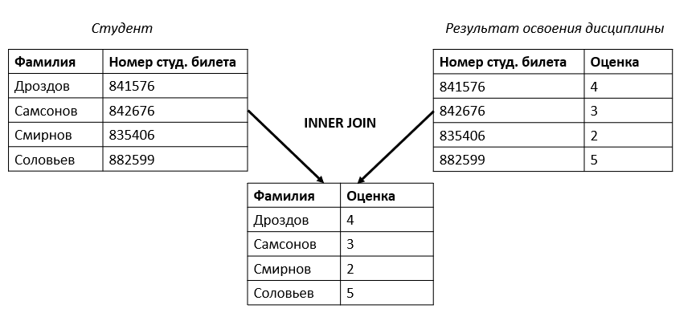
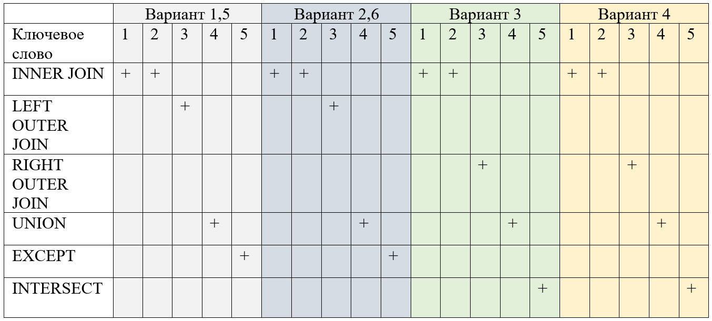

# Базы данных

## Лабораторная работа № 3. Использование объединяющих и вложенных запросов языка SQL


- [Теоретическая часть](#теоретическая-часть)
  - [Соединение таблиц](#соединение-таблиц)
    - [Неявное соединение таблиц](#неявное-соединение-таблиц)
    - [Соединение с помощью JOIN](#соединение-с-помощью-join)
    - [Объединение, разность, пересечение таблиц](#объединение-разность-пересечение-таблиц)
    - [Пример соединения и объединения таблиц](#пример-соединения-и-объединения-таблиц)
  - [Подзапросы](#подзапросы)
    - [Некоррелированный запрос](#некоррелированный-запрос)
    - [Коррелированные запросы](#коррелированные-запросы)
- [Практическая часть](#практическая-часть)
  - [Задание 1](#задание-1)
  - [Задание 2](#задание-2)
  - [Задание 3](#задание-3)
  - [Задание 4](#задание-4)
  - [Задание 5](#задание-5)


### Теоретическая часть

В предыдущей лабораторной работе были рассмотрены примеры запросов на выборку данных из одной таблицы. Однако, существует большое число задач, когда требуется проанализировать информацию из нескольких таблиц. Для этого существуют операции соединения.   

#### Соединение таблиц

##### Неявное соединение таблиц  

Самым простым способом является неявное соединение таблиц, когда таблицы объединяются перекрестно. Другими словами, каждой строка одной таблицы будет совмещаться с каждой строкой второй таблицы. В данном случае мы получаем прямое (декартово) произведение двух таблиц.   

На языке SQL для неявного соединения необходимо указать требуемые таблицы через запятую после оператора **FROM**.   

Предположим, что нам необходимо вывести ФИО всех преподавателей и полное название подразделения, в котором они трудоустроены. Для этого соединим таблицы Структурное подразделение и Трудоустройство. Для этого возможно выполнить следующий запрос:    

```sql
SELECT abbreviated_title, professor_id, surname FROM structural_unit, employment, professor;
```

| abbreviated_title | professor_id |
|-------------------|--------------|
| Институт МПСУ     | 81001        |
| Институт МПСУ     | 81002        |
| Институт МПСУ     | 81003        |
| Институт МПСУ     | 81004        |
| Институт МПСУ     | 81005        |
| Институт МПСУ     | 81006        |
| Институт МПСУ     | 81007        |
| Институт МПСУ     | 81008        |


В результате запроса будет выведены значения из двух таблиц, где каждому значению из второй будут соответствовать все значения из первой таблицы. Таким образом, будет выведено (число строк в первой таблице) * (число строк во второй таблице). В данном примере будет выведено 24 строки.    

Аналогично добавим к данным двум таблицам ещё таблицу professor.   

```sql
SELECT abbreviated_title, professor_id, surname FROM structural_unit, employment, professor;
```

| abbreviated_title | surname | wage_rate |
|-------------------|---------|-----------|
| Институт МПСУ     | Широков | 0.25      |
| Институт СПИНТех  | Широков | 0.25      |
|                   | Широков | 0.25      |
| ВМ-1              | Широков | 0.25      |
|                   | Широков | 0.25      |
| ЛПО               | Широков | 0.25      |
| ПМТ               | Широков | 0.25      |
| ЦД                | Широков | 0.25      |

Очевидно, что такой результат запроса нас не устроит. Для того, чтобы отобрать только преподавателей, прикрепленных к месту работы, необходимо добавить условие отбора.    

Выберем только те строки, где значения номера подразделения в таблицах structural_unit и employment и значения номера преподавателя в таблицах employment и professor совпадают. 

Итоговый запрос будет выглядеть следующим образом:    

```sql
SELECT professor.surname, professor.name, professor.patronymic ,structural_unit.abbreviated_title 
FROM structural_unit, employment, professor
WHERE structural_unit.structural_unit_id = employment.structural_unit_number AND employment.professor_id = professor.professor_id
```

| surname |  name   | patronymic  | abbreviated_title |
|---------|---------|-------------|-------------------|
| Широков | Василий | Иванович    | Институт МПСУ     |
| Семенов | Андрей  | Сергеевич   | Институт МПСУ     |
| Филатов | Илья    | Иванович    | Институт МПСУ     |
| Ермаков | Виктор  | Денисович   | Институт МПСУ     |
| Марков  | Виктор  | Дмитриевич  | Институт МПСУ     |
| Воронов | Николай | Михайлович  | Институт МПСУ     |
| Хахалин | Василий | Тихонович   | Институт МПСУ     |
| Козин   | Николай | Дмитриевич  | Институт МПСУ     |


##### Соединение с помощью JOIN

Соединённая таблица — это таблица, полученная из двух других таблиц в соответствии с правилами соединения. Общий синтаксис описания соединённой таблицы:    

```sql
T1 тип_соединения T2 [ условие_соединения ]
```

Кроме неявного соединения таблиц в языке SQL существует альтернативная форма записи операций соединение таблиц с помощью ключевого слова **JOIN**. Объединение происходит по столбцу, который есть в каждой из таблиц.     

По типу соединения операторы **JOIN** подразделяются на внутренние и внешние — **INNER JOIN** и **OUTER JOIN**.   

Внутреннее соединение - **INNER JOIN** используется для отбора строк из двух таблиц, в которых совпадают значения поля, по которому происходит объединение.    

Например, объединим таблицы «Студент» и «Результат освоения дисциплины». Каждая из этих таблиц содержит поле студенческого билета. Произведем по этому полю соединение.    

```sql
SELECT surname, name, mark
FROM Student
INNER JOIN Field_comprehension
ON Field_comprehension.student_id = Student.student_id;
```

В результате выполнения запроса на экран будет выведена информация об оценках всех студентов института.   



Внешнее соединение - **OUTER JOIN** можно разделить на правое (RIGHT), левое (LEFT) и полное (FULL).    


Операция левого внешнего соединения возвращает кроме обычного результата соединения, строки из левого операнда, для которых не нашлось парного значения строки в правом операнде. Вместо значений атрибутов правого операнда будет указано неопределенное значение NULL.    

Аналогично, операция правого внешнего соединения возвращает все строки, для которых не нашлось пары в первом операнде.    

Полное внешнее соединение включает в себя все пересекающиеся строки и все непарные строки из обеих таблиц.    

Аналогично неявному соединению, возможно произвести декартово произведение таблиц с помощью оператора **JOIN**. Для этого существует ключевое слово **CROSS**.   

С помощью операций соединения возможно соединять несколько таблиц.    
Рассмотрим это на примере более сложного запроса. Необходимо вывести всех преподавателей и структурное подразделение, к которым они прикреплены.   

Данные о преподавателях хранятся в таблице professor. Данные об структурных подразделениях – в таблице structural_unit. Общих столбцов у данных таблиц нет, поэтому необходимо соединить их вместе с промежуточной таблицей – employment.   

```sql
SELECT professor.surname, professor.name, professor.patronymic, structural_unit.full_title
FROM professor
INNER JOIN employment ON 
employment.professor_id = professor.professor_id
INNER JOIN structural_unit ON 
structural_unit.structural_unit_id = employment.structural_unit_number
```

|    surname    |    name    |  patronymic   |                             full_title                              |
|---------------|------------|---------------|---------------------------------------------------------------------|
| Александрова  | Александра | Александровна | Кафедра высшей математики № 1                                        |
| Аркадина      | Ирина      | Николаевна    | Кафедра высшей математики № 1                                        |
| Баранова      | Виктория   |               | Кафедра высшей математики № 1                                        |
| Березина      | Наталия    | Владимировна  | Институт высокотехнологичного права, социальных и гуманитарных наук |
| Быкова        | Елена      | Николаевна    | Кафедра высшей математики № 1                                        |
| Вернадский    | Владимир   | Иванович      | Институт цифрового дизайна                                           |
| Витгенштейн   | Людвиг     |               | Институт лингвистического и педагогического образования             |
| Воронов       | Николай    | Михайлович    | Институт микроприборов и систем управления имени Л.Н. Преснухина    |

##### Объединение, разность, пересечение таблиц

Кроме соединения таблиц, когда в результате операции атрибуты одной таблицы будут добавлены к атрибутам другой существуют операции **объединения**. В данном случае число атрибутов не изменяется, но в итоговой таблице будут содержаться значения из нескольких таблиц. При объединении таблиц необходимо соблюдать условие, что тип данных каждого столбца первой таблицы должен совпадать с типом данных соответствующего столбца во второй таблице. Имена столбцов в объединяемых таблицах не обязательно должны быть одинаковыми.    

В языке SQL для объединения таблиц используется оператор **UNION**. 

```sql
запрос1 UNION [ALL] запрос2
```

Т.к. оператор UNION объединяет строки из двух таблиц результатов, в объединенной таблице могут содержаться повторяющиеся строки. По умолчанию оператор UNION в процессе своего выполнения удаляет повторяющиеся строки.    

Кроме операции объединения существуют операции **пересечения** (INTERSECT) и **разности** (EXCEPT). Операция пересечения оставляет только общие строки из двух таблиц, а операция разности удаляет из первой таблицы значения, содержащиеся во второй. Данные три операции в языке SQL тесно связаны с логическими операциями булевой алгебры.  

| Операция     | SQL операция | Логическая операция |
|--------------|--------------|----------------------|
| Объединение  | UNION       | A **OR** B               |
| Пересечение  | INTERSECT   | A **AND** B              |
| Разность     | EXCEPT      | A **AND NOT** B          |

##### Пример соединения и объединения таблиц

<!-- TODO: Разобрать пример -->

#### Подзапросы 

Результатом выполнения запроса является набор кортежей, оформленный в виде таблицы. Данную таблицу возможно вывести на экран для просмотра или использовать в других запросах. В таком случае, запрос, используемый внутри другого запроса, называют вложенным запросом или подзапросом.   

Существуют два типа подзапросов:   

* **Некоррелированный подзапрос** – оператор `SELECT` вложенный в другой запрос SQL, не связанный с внешним запросом (он может быть выполнен отдельно от него).
* **Коррелированный подзапрос** – оператор `SELECT` вложенный в другой запрос SQL, и ссылающийся на один или несколько столбцов внешнего запроса. 

Рассмотрим типы запросов на примерах.    

##### Некоррелированный запрос

Выведем всех преподавателей, чей оклад больше среднего. Для этого создадим подзапрос, вычисляющий среднюю зарплату всех преподавателей вуза. Далее, используя скалярный результат этого подзапроса найдем все большие значения.   

```sql
SELECT professor.surname, professor.name ,professor.сurrent_position
FROM professor
WHERE professor.salary::numeric > 
(
	SELECT AVG(professor.salary::numeric) 
	FROM professor
)
```

|    surname   |    name    | сurrent_position |
|--------------|------------|------------------|
| Широков     | Василий    | доцент           |
| Семенов     | Андрей     | профессор        |
| Филатов     | Илья       | доцент           |
| Воронов     | Николай    | доцент           |
| Орлов       | Даниил     | профессор        |
| Овсянников  | Даниил     | доцент           |
| Воронов     | Артём      | доцент           |
| Михайлова   | Анастасия  | профессор        |


Выведем всех студентов, которые имеют хотя бы одну оценку 2 за один из экзаменов. Для этого создадим подзапрос, выбирающих всех двоечников и используя их номера студенческого билета найдем их фамилию и имя.    

```sql
SELECT surname, name 
FROM student
WHERE student.student_id IN(
	SELECT field_comprehension.student_id
	FROM field_comprehension
	WHERE field_comprehension.mark = 2
)
```

|  surname  |    name    |
|-----------|------------|
| Алехин    | Андрей     |
| Коровина  | Мария      |
| Кузьмин   | Мирослав   |
| Гаврилов  | Александр  |
| Самойлов  | Артём      |
| Новиков   | Кирилл     |
| Маркин    | Даниэль    |
| Беляков   | Иван       |


##### Коррелированные запросы

Создадим аналогичный запрос с поиском всех студентов, имеющих хотя бы одну оценку 2, но с помощью коррелированного запроса. Обратите внимание, что во вложенном запросе происходит обращение к таблице «Студент», не указанной после ключевого слова **FROM** данного подзапроса. Если мы попытаемся запустить отдельно от основного данный подзапрос, то в результате будет получена ошибка.      

```sql
SELECT surname, name 
FROM student
WHERE 2 = ANY
(
	SELECT field_comprehension.mark
	FROM field_comprehension
	WHERE field_comprehension.student_id = student.student_id
)
```

|  surname  |    name    |
|-----------|------------|
| Алехин    | Андрей     |
| Коровина  | Мария      |
| Кузьмин   | Мирослав   |
| Гаврилов  | Александр  |
| Самойлов  | Артём      |
| Новиков   | Кирилл     |
| Маркин    | Даниэль    |
| Беляков   | Иван       |

Создадим запрос, выводящий средний балл каждого из студентов. Для этого создадим подзапрос, вычисляющий средний балл и ссылающийся на атрибут "Студент"."Номер студенческого билета" из внешнего запроса.    

```sql
SELECT surname, name, (
    SELECT CAST(AVG(mark) AS NUMERIC(2,1))
    FROM Field_comprehension
    WHERE Field_comprehension.student_id = Student.student_id
) AS "Средняя оценка"
FROM Student
ORDER BY "Средняя оценка" DESC;
```

|  surname  |  name   | Средняя оценка |
|-----------|---------|----------------|
| Князева   | Есения  |            4.4 |
| Хомяков   | Илья    |            4.3 |
| Андреева  | Ева     |            4.3 |
| Григорьев | Даниил  |            4.3 |
| Селезнев  | Максим  |            4.3 |
| Казаков   | Николай |            4.3 |
| Ершова    | Валерия |            4.3 |
| Морозов   | Илья    |            4.2 |


### Практическая часть

Напишите SQL запросы к учебной базе данных в соответствии с вариантом.  

#### Задание 1

| № варианта | Запрос                                                                                                          |
|------------|-----------------------------------------------------------------------------------------------------------------|
| 1          | Выведите фамилии и имена всех людей, кто причастен к вузу.                                                       |
| 2          | Выведите список имен студентов и преподавателей, которые совпадают.                                               |
| 3          | Выведите имена студентов, которые не совпадают с именами преподавателей.                                          |
| 4          | Сделайте проверку, все ли преподаватели трудоустроены.                                                            |
| 5          | Выведите номер студенческого билета студента, который получил 2 по любым дисциплинам.                             |
| 6          | Вывести ФИО преподавателей, которые работают на четверть ставки.                                                  |


#### Задание 2

| № варианта | Запрос                                                                                                        |
|------------|----------------------------------------------------------------------------------------------------------------|
| 1          | Выведите информацию о том, к каким институтам относятся группы.                                                 |
| 2          | Выведите ФИО преподавателей, их предметы и в каких группах они ведут.                                          |
| 3          | Выполните запрос, выводящий группу, ее институт/кафедру, руководителя.                                         |
| 4          | Выведите Фамилии и Имена студентов, кто получил 5 по Базам данных.                                              |
| 5          | Вывести ФИО преподавателей, у которых зарплата больше 20 000.                                                   |
| 6          | Отсортировать результат предыдущего задания по алфавиту и исключить повторения после выполнения запроса.      |


#### Задание 3

| № варианта | Запрос                                                                                                     |
|------------|-----------------------------------------------------------------------------------------------------------------|
| 1          | Выведите все номера преподавателей и проверьте, есть ли совпадения с номерами студентов.                       |
| 2          | Сделайте запрос на проверку трудоустройства преподавателей.                                                    |
| 3          | Выведите весь список студентов и проверьте оценки по всем дисциплинам только у ИБ-21.                           |
| 4          | Выведите студента, его группу и преподавателя, у которого фамилия = фамилия студента.                          |
| 5          | Выведите список принадлежности учебных групп к структурным подразделениям.                                     |
| 6          | Выведите почты студентов и ФИО, у которых пароль начинается с 2002.                                           |

#### Задание 4

| № варианта | Запрос                                                                                                     |
|------------|-----------------------------------------------------------------------------------------------------------------|
| 1          | Выведите самое часто повторяемое имя у студентов.                                                            |
| 2          | Выведите полные названия структурных подразделений, который обучают очно.                                    |
| 3          | Выведите номера студенческих билетов и когда истечет их срок у студентов группы ИБ-21.                        |
| 4          | Выведите фамилию и имя всех студентов, кто учится заочно.                                                    |
| 5          | Выведите преподавателей, среднюю оценку их студентов, которая выше средней по институту.                      |
| 6          | Сгруппировать предыдущее задание по группам. Посчитать, сколько человек из каждой группы

#### Задание 5


