# Базы данных

## Лабораторная работа № 4. Создание логической и физической модели базы данных

- [Теоретическая часть](#теоретическая-часть)
  - [Проектирование базы данных](#проектирование-базы-данных)
  - [Логическое моделирование. ER-модель](#логическое-моделирование-er-модель)
  - [Пример ER-диаграммы](#пример-er-диаграммы)
  - [Физическое проектирование](#физическое-проектирование)
    - [Создание таблиц](#создание-таблиц)
    - [Изменение таблиц](#изменение-таблиц)
    - [Удаление таблиц](#удаление-таблиц)
    - [Ограничения](#ограничения)
- [Практическая часть](#практическая-часть)
  - [Задание 1](#задание-1)
  - [Задание 2](#задание-2)
  - [Задание 3](#задание-3)
  - [Задание 4](#задание-4)
  - [Задание 5](#задание-5)
- [Приложение](#приложение)
  - [Работа с программой ERWin](#работа-с-программой-erwin)
    - [Интерфейс ERWin. Уровни отображения модели](#интерфейс-erwin-уровни-отображения-модели)
    - [Сущности и атрибуты](#сущности-и-атрибуты)
    - [Связи](#связи)


### Теоретическая часть

#### Проектирование базы данных

Проектирование баз данных в общем виде является сложной и трудоемкой задачей. В общем случае её можно сформулировать, как выбор подходящей логической структуры для заданного массива данных, который необходимо поместить в базу данных.   

Другими словами, необходимо выделить требуемые отношения (таблицы) и содержащиеся в них атрибуты (столбцы). По окончанию проектирования созданную базу данных необходимо преобразовать в форму, которая может быть воспринята конкретной СУБД.    


Проектирование базы данных можно разделить на несколько этапов:    
* **Концептуальное** (семантические, инфологическое) – на данном этапе происходит анализ и определение понятий предметной области
* **Логическое** – создание схемы данных на основе заданной модели без учета специфики СУБД
* **Физическое** – создание базы данных с учетом специфики СУБД

Данная лабораторная работа посвящена созданию логической и физической моделей базы данных. Логическая модель данных будет изучаться на примере создания ER-модели или модели «*сущность-связь*».  Физическая модель данных будет представлена в виде запросов для СУБД PostgreSQL.   

#### Логическое моделирование. ER-модель

ER-модель является одним из самых распространенных средств для представления структуры баз данных. В ней структура данных отображается графически в виде диаграммы сущностей и связей. Данная диаграмма состоит из элементов трех типов:   

* Сущности
* Атрибуты
* Связи


**Сущность** – абстрактный объект определенного типа. Например, в базе данных Студентов вуза можно выделить сущности student, professor, structural_unit и др.   

**Атрибут** – свойство множества сущностей. Например, сущности student, могут быть поставлены в соответствии атрибуты *surname, name, student_id* и др. У каждой сущности возможно выделить подмножество, обладающее свойствами уникальности и неизбыточности – потенциальный ключ. Напомним, что выбранный потенциальный ключ, характеризующий конкретную запись в таблице называется первичным ключом. На каждый атрибут можно наложить ограничения, чтобы не допускать добавление в базу данных некорректных значений.   

**Связи** – соединения между двумя и большим числом сущностей. Например, между сущностями «Студент» и «Группа» возможно провести связь – «студенты, обучающиеся в группе». Наиболее распространенными являются бинарные связи, соединяющие два множества сущностей. 
Существуют несколько типов связи – 1:1, 1:N, N:N. Рассмотрим их подробнее.   

Связь «один к одному» (1:1) – в случае данной связи каждой записи из одной таблицы будет соответствовать одна уникальная запись в другой. Например, у каждого студента есть студенческий билет, поэтому связь между сущностями «Студент» и «Студенческий билет» будет один к одному. Связь между таблицами происходит за счет совпадения значений первичных ключей в обоих таблицах.  

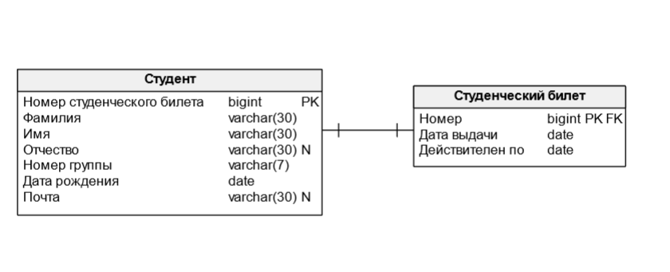

Связь «один ко многим» (1:N) – один из наиболее распространенных типов связи. В данном случае, одной записи главной таблицы можно сопоставить несколько записей подчинённой таблицы. Например, в одной группе может обучаться множество студентов.    

Таким образом, в данном случае связь между атрибутами будет один ко многим. 

Связь между таблицами происходит за счет **внешних ключей** (FK, от Foreign Key) – атрибута отношения, значения которого полностью совпадают со значениями потенциального ключа другой таблицы. Например, атрибут «Номер группы» в таблице «Студент» является внешним ключом, т.к. он связан с первичным ключом «Номер группы» таблицы «Группа». Данный атрибут отмечен символом FK.   

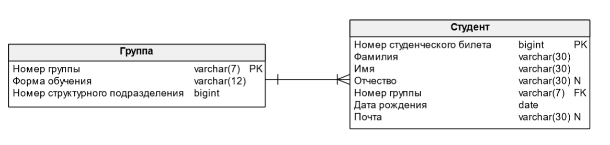

Связь «Многие ко многим» (N:N) предполагает возможность связи одного или нескольких элементов из одной таблицы с одним или несколькими элементами из другой таблицы. В случае рассматриваемого примера один преподаватель может работать в нескольких структурных подразделениях, а в одном структурном подразделении могут содержаться несколько преподавателей. Данный тип связи нереализуем в рамках физической модели, поэтому представляется в виде создания дополнительной таблицы, содержащей ключевые поля соединяемых отношений. Например, structural_unit и professor соединены посредством таблицы «Трудоустройство».   

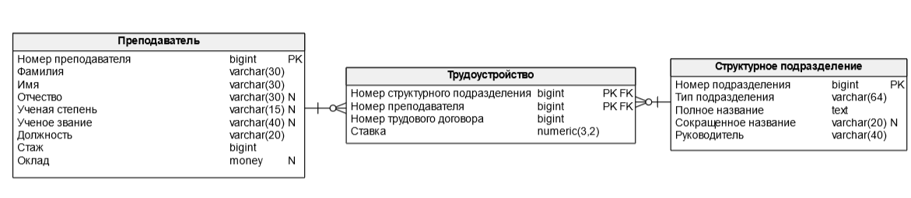

Существует несколько вариантов нотаций записи ER-моделей в форме диаграмм. В данном лабораторном практикуме будет рассмотрена ER-диаграмма в нотации Гордона Эвереста.   

Согласно данной нотации, **сущность** изображается в виде прямоугольника, содержащее её имя. Имя сущности должно быть уникальным в рамках одной модели. **Атрибуты** сущности записываются внутри данного прямоугольника. **Связь** изображается линией, которая связывает две сущности, участвующей в отношении. Каждая связь должна именоваться глаголом или глагольной фразой.   

В зависимости от типа связи возможно различное обозначение конца линии.   

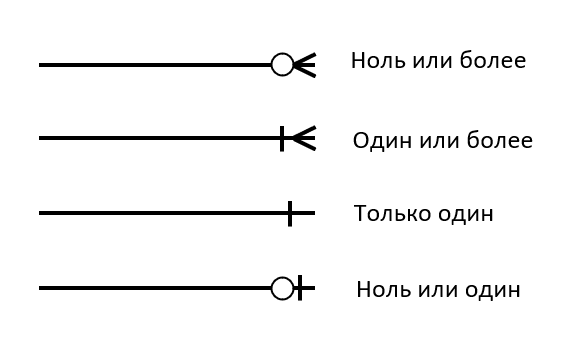

В случае связи один к одному, на конце линии указывается вертикальная черта, в случае один ко многим указывается изображение вилки или вороньей лапки.   

#### Пример ER-диаграммы

Рассмотрим пример разработки ER-диаграммы на основе базы данных о студентах вуза. В ней необходимо хранить информацию о студенте, группе его обучения, структурном подразделении, в котором состоит эта группа, оценках за дисциплины и преподавателей, проставивших эти оценки.   

Первым делом, выделим требуемые сущности – Студент, Дисциплина, Группа, Преподаватель, Структурное подразделение. Рассмотрим сущности по отдельности.   

Сущность «**Студент**» будет содержать следующие атрибуты: ФИО, Дата рождения, Номер студенческого билета, информацию о нем, Номер группы и Адрес электронной почты. Допустим, что каждого студента определяет номер его студенческого билета – он является уникальным. Поэтому, выберем его в качестве **Первичного ключа**.  Добавим ограничение на формат электронной почты. Она будет представлять из себя строку вида [TEXT]@[TEXT].[DOMAIN], где TEXT может содержать любые английские буквы и числа, а домен только английские буквы.   

Т.к. поля с информацией о студенческом билете зависят только от номера билета, но не от студента, то логично разделить данную сущность на две – одна будет описывать студента (человека), вторая – студенческий билет (документ).    

Поэтому выделим еще одну сущность – «**Студенческий билет**» и соединим её со Студентом связью 1:1, т. е. каждому студенту будет соответствовать свой студенческий билет. В качестве атрибутов билета выберем дату выдачи и дату окончания действия.   

Сущность «**Группа**» будет содержать в себе следующие атрибуты: «Номер группы» - в качестве первичного ключа, Форму обучения и Номер структурного подразделения, в котором состоит эта группа. На номер группы будет наложено ограничение – [текст]-[МВ Номер], где текст – любое буквосочетание, а номер – любые цифры. Форма обучения может быть только очной, заочной или очно-заочной.   

Сущность structural_unit будет содержать в себе название подразделение – полное и сокращенное, тип подразделения (кафедра, институт) и ФИО руководителя. В качестве ключа будет выбран суррогатный ключ – Номер подразделения.   

Сущность professor будет содержать в себе его ФИО, должность, ученую степень (в формате [к/д].[текст].н, где текст – название отрасли наук), ученое звание, стаж и оклад. В качестве ключа выбран суррогатный ключ – Номер преподавателя.   

Сущность «**Дисциплина**» будет включать в себя суррогатный ключ – Номер преподавателя, название дисциплины, зачетные единицы трудоемкости (ЗЕТ), структурное подразделение и преподаватель – внешней ключи, для связи с одноименными сущностями. 

Т.к. один студент может иметь оценки по разным дисциплинам и одной дисциплине могут обучаться несколько студентов, то связь между этими сущностями будет многие ко многим.  Для реализации данной связи добавим еще одну сущность, «Результат освоения дисциплины», содержащую в себе два ключа – Студент и Дисциплина. Данные атрибуты одновременно будут являться и внешними ключами, для связи с одноименными сущностями. Также данная сущность будет содержать в себе атрибут с оценкой за дисциплину. Оценка может принимать значения от 2 до 5 включительно.   

Аналогично, связь между преподавателем и структурным подразделением будет многие ко многим. Поэтому добавим сущность «**Трудоустройство**», содержащую ключи из связанных таблиц, номер трудового договора и ставку.   

Итоговая ER-диаграмма:  

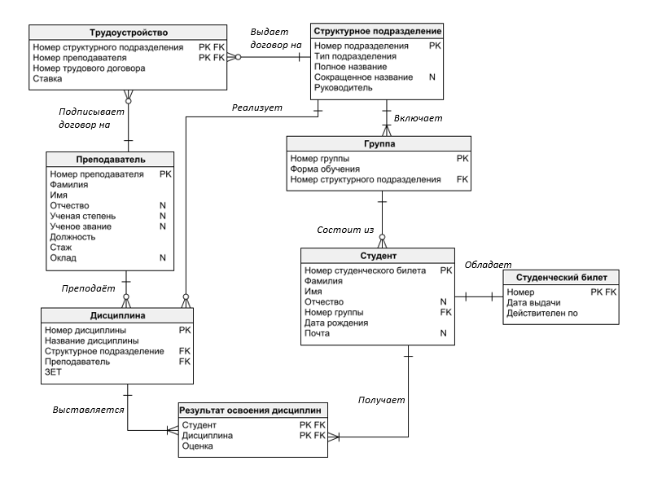

#### Физическое проектирование

##### Создание таблиц

После разработки логической модели возможно создать физическую модель, связанную с конкретной СУБД. В качестве СУБД выбрана PostgreSQL.   

Создание таблиц в PostgreSQL происходит с помощью команды `CREATE TABLE`.   

```sql
CREATE TABLE [ IF NOT EXISTS ] имя_таблицы 
( 
	имя_столбца тип_данных [ ограничение_столбца [ ... ] ]
	[ ограничение_таблицы ]
);
```
Например, для создания таблицы structural_unit возможно выполнить следующий SQL запрос.   

```sql
CREATE TABLE Structural_unit(
    structural_unit_id SERIAL,
    unit_type VARCHAR(64),
    full_title TEXT,
    abbreviated_title VARCHAR(20),
    head_of_the_unit VARCHAR(40)
);
```

##### Изменение таблиц

Для изменения таблиц базы данных используется команда `ALTER TABLE`   


```sql
ALTER TABLE [ IF EXISTS ] [ ONLY ] имя [ * ]
    действие [, ... ]
```

В качестве действия могут быть добавление, изменение и удаление конкретного столбца, изменение типов данных и др. Синтаксис некоторых возможных действий представлен ниже:    

```sql
ALTER TABLE [ IF EXISTS ] [ ONLY ] имя [ * ]
    ADD [ COLUMN ] [ IF NOT EXISTS ] имя_столбца тип_данных [ COLLATE правило_сортировки ] [ ограничение_столбца [ ... ] ]
    DROP [ COLUMN ] [ IF EXISTS ] имя_столбца [ RESTRICT | CASCADE ]
    ALTER [ COLUMN ] имя_столбца [ SET DATA ] TYPE тип_данных [ COLLATE правило_сортировки ] [ USING выражение ]
    ALTER [ COLUMN ] имя_столбца SET DEFAULT выражение
    ALTER [ COLUMN ] имя_столбца DROP DEFAULT
```

Приведем несколько примеров: 
Добавление в таблицу «Студент» столбца «Адрес»:   

```sql
ALTER TABLE student
ADD COLUMN address varchar(30);
```

Изменение столбца адрес – увеличение его объема.    

```sql
ALTER TABLE student
ALTER COLUMN address TYPE varchar(80);
```

Удаление столбца с адресом   

```sql
ALTER TABLE student 
DROP COLUMN address RESTRICT;
```

##### Удаление таблиц

Удаление таблицы происходит с помощью команды `DROP TABLE`   

```sql
DROP TABLE [ IF EXISTS ] имя [, ...] [ CASCADE | RESTRICT ]
```

В качестве параметра возможно указать ключевые слова **CASCADE** и **RESTRICT**. 
**CASCADE** - автоматически удаляются объекты, зависящие от данной таблицы (например, представления).
**RESTRICT** - отказ в удалении таблицы, если от неё зависят какие-либо объекты (по умолчанию).
Пример удаления таблицы students   

```sql
DROP TABLE students;
```

##### Ограничения

Типы данных накладывают множество ограничений на данные, которые можно сохранить в таблице. Однако для многих баз данных такие ограничения слишком грубые. Например, в случае установки для значения оценки типа BIGINT, это значение должно лежать в пределах от 2 до 5. Для указания ограничений для атрибутов существуют специальные ключевые слова.    

| Ключевое слово  | Описание                                  |
|-----------------|-------------------------------------------|
| **PRIMARY KEY**     | Первичный ключ                            |
| **FOREIGN KEY**     | Внешний ключ                              |
| **NOT NULL**        | Значение не может принимать значение NULL |
| **NULL**            | Значение может принимать значение NULL    |
| **CHECK** (условие) | Проверка условия                          |
| **UNIQUE**          | Уникальность атрибута                      |
| **DEFAULT**         | Установка значения по умолчанию           |


Самый простой способ установки ограничений – использование ключевого слова **CHECK**. В его определении возможно указать, что значение данного столбца будет удовлетворять логическому выражению (проверке истинности).  
Например, укажем, что оценка может быть от 2 до 5:    

```sql
mark INTEGER NOT NULL CHECK (mark >=2 AND mark <=5)
```

Для указания того, что атрибут является первичным ключом, используются ключевые слова **PRIMARY KEY**. Например:   

```sql
structural_unit_id SERIAL PRIMARY KEY
```

Аналогично можно указать, что значения атрибута могут/не могут принимать значения **NULL**, являются уникальными. Для этого используются слова **NOT NULL**, **NULL**, **UNIQUE**.   

```sql
patronymic VARCHAR(30) NULL
birthday DATE NOT NULL
email VARCHAR(30) UNIQUE
```

Каждому ограничению возможно присвоить отдельное имя. Для этого перед ограничением, указывается ключевое слово **CONSTRAINT** и название ограничения после него.   

```sql
CONSTRAINT email_cheak 
        CHECK (email ~* '^[A-Za-z0-9._+%-]+@[A-Za-z0-9.-]+[.][A-Za-z]+$')
```

Для организации связей между таблицами необходимо добавить внешние ключи. Для этого в строке атрибута указывается, ключевое слово **REFERENCES** далее за ним идет название связываемой таблицы и в скобках указывается имя связываемого атрибута.    

```sql
student INTEGER NOT NULL REFERENCES student(student_id)
```

Все ограничения возможно выносить за пределы строки с атрибутом. 
Рассмотрим пример создания таблицы «Студент»   

```sql
CREATE TABLE Student(
    student_id INTEGER NOT NULL,
    surname VARCHAR(30) NOT NULL,
    name VARCHAR(30) NOT NULL,
    patronymic VARCHAR(30) NULL,
    students_group_number VARCHAR(7) NOT NULL,
    birthday DATE NOT NULL,
    email VARCHAR(30) UNIQUE,
    PRIMARY KEY(student_id),
    CONSTRAINT Students_group_key
        FOREIGN KEY(students_group_number) 
            REFERENCES Students_group(students_group_number)
            ON DELETE CASCADE,
    CONSTRAINT email_cheak 
        CHECK (email ~* '^[A-Za-z0-9._+%-]+@[A-Za-z0-9.-]+[.][A-Za-z]+$')
);
```

В данном случае все ограничения на ключи и **CHECK** были вынесены за пределы строк с атрибутами. Для указания внешнего ключа использовалось ключевое слово **FOREIGN KEY**. Для обеспечения каскадного удаления всех связанных с записью строк по ключам используются ключевые слова **ON DELETE CASCADE**.    

В завершении работы приведем итоговую схему данных с учетом всех заданных типов.   

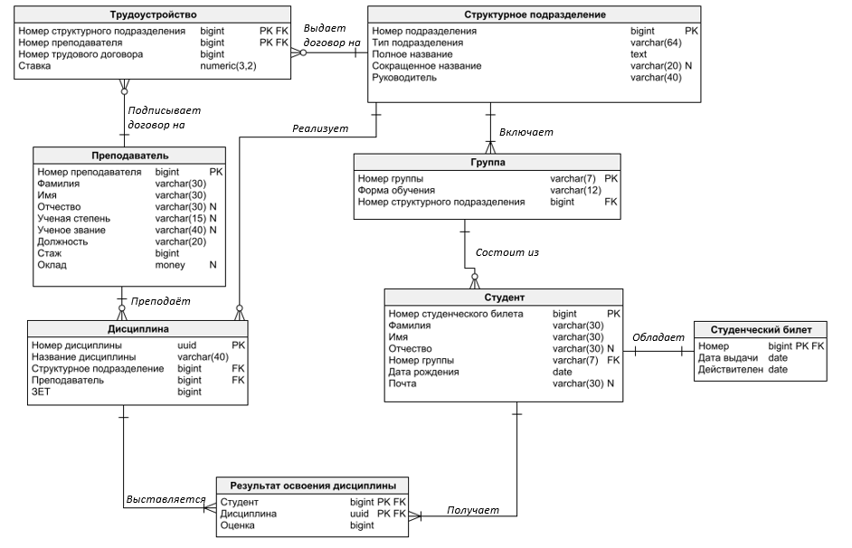


### Практическая часть

#### Задание 1

В учебной базе данных одним из допущений является возможность прикрепить только одного преподавателя к дисциплине. Исправьте его.    

#### Задание 2

Добавьте в таблицу *Professor* поле, содержащее его контактный телефон. Сделайте ограничение, позволяющее хранить номер телефона в формате: +7(XXX)XXX-XX-XX или 8(XXX)XXX-XX-XX   

#### Задание 3

Добавьте в таблицу *Students_group* поле, содержащее информацию о старосте. Старостой группы может быть только один из студентов, обучающихся в ней.  

#### Задание 4

В соответствии с вариантом доработайте базу данных. Вариант выбирается в соответствии с формулой: N = (N_в_списке mod 10) + 1. При доработке БД должно быть добавлено не менее трех новых таблиц. 

| Вариант | Описание                                                              |
|---------|-----------------------------------------------------------------------|
| 1       | Добавить возможность прикрепления студентов на места практики          |
| 2       | Добавить возможность занятости студентов в спортивных секциях         |
| 3       | Добавить студенческие объединения                                     |
| 4       | Добавить военную кафедру                                              |
| 5       | Добавить общежитие                                                    |
| 6       | Добавить медпункт и возможность выхода студента на больничный         |
| 7       | Добавить возможность получения студентами льгот и стипендии            |
| 8       | Добавить курсы повышения квалификации для преподавателей               |
| 9       | Добавить портфолио студентам                                          |
| 10      | Добавить студенческий офис                                            |


#### Задание 5

В соответствии с вариантом доработайте физическую модель базы данных в СУБД PostgreSQL.  

### Приложение

#### Работа с программой ERWin

ERwin имеет два уровня представления модели – **логический** и **физический**. 
Логический уровень — это абстрактное описание данных, на нем данные представляются так, как выглядят в реальном мире, и могут называться так, как они называются в **реальном мире** (например, на кириллице и с использованием специальных символов).    

Логическая модель данных разрабатывается на основе существующих моделей данных (например, реляционной), но никак не связана с конкретной реализацией системы управления базы данных (СУБД) и прочих физических условий реализации. Она может быть построена на основе другой логической модели, например, на основе модели потоков данных или процессов.   

##### Интерфейс ERWin. Уровни отображения модели

При создании новой логической модели с целью дальнейшего создания на ее основе модели физической необходимо установить переключатель типа модели в положений «Logical/Physical» остальные значения оставить без изменения.   

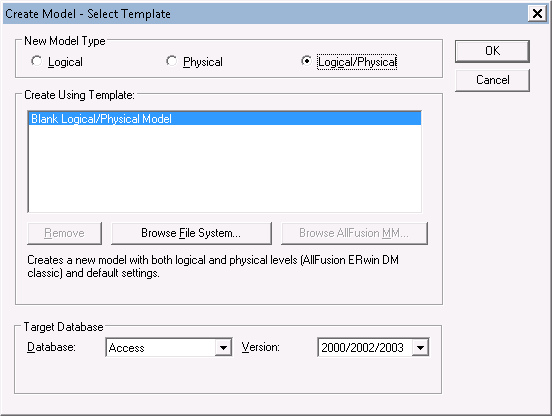

Палитра инструментов выглядит различно на разных уровнях отображения модели.    

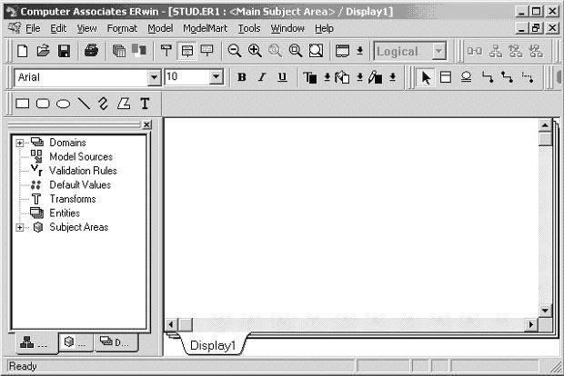

Рассмотрим кратко основные функции ERwin по отображению модели, а также панель и палитру инструментов.     


Для создания типов сущностей модели и связывания их между собой используются палитра инструментов:    

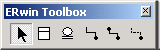

Палитра инструментов:   


##### Сущности и атрибуты

Основные компоненты диаграммы ERWin – это сущности, атрибуты и связи. 
**Сущность** можно определить как объект, событие или концепцию, информация о которой должна сохраняться. Сущности должны иметь наименование с четким смысловым значением, фактически это имя ее экземпляра. Например, сущность *Заказчик* с атрибутами *Номер заказчика*, *Фамилия заказчика*, *Адрес заказчика*.   

Entity Editor в контекстном меню для сущности позволяет определить имя, описание, комментарии, иконку.   

Для описания **атрибутов сущности** выбирается пункт Attribute Editor. Здесь можно указать имя нового атрибута и домен, который будет использоваться при определении типа колонки на уровне физической модели. Атрибуты должны именоваться в единственном числе и иметь четкое смысловое значение. Каждый атрибут должен быть определен (закладка Definition), при этом следует избегать циклических определений и производных атрибутов. Для атрибутов первичного ключа (это атрибут или группа атрибутов, идентифицирующая сущность) необходимо сделать пометку в окне выбора Primary Key.    

##### Связи

Связь является логическим соотношением между сущностями. Каждая связь должна именоваться глаголом или глагольной фразой (Relationship Verb Phrases). Имя связи облегчает чтение диаграммы, например:   

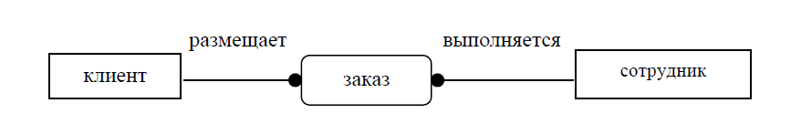

По умолчанию имя связи на диаграмме не показывается. Для отображения имени следует в контекстном меню для свободного места диаграммы выбрать пункт Display Option/relationship и включить опцию Verb Phrase.    

На логическом уровне можно установить идентифицирующую связь один-ко-многим, связь многие-ко-многим и неидентифицирующую связь один-ко-многим (кнопки в палитре инструментов). Тип сущности определяется ее связью с другими сущностями. Различают зависимые и независимые сущности.      

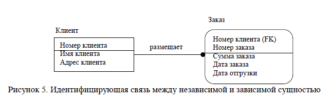

**Идентифицирующая** связь устанавливается между независимой (родительский конец связи) и зависимой (дочерний конец связи) сущностями. **Когда рисуется идентифицирующая связь, ERWin автоматически преобразует дочернюю сущность в зависимую.** Зависимая сущность изображается прямоугольником со скругленными углами (в предыдущем примере сущность Заказ). Информация о заказе не может быть внесена и не имеет смысла без информации о клиенте, который ее размещает.    

При установлении идентифицирующей связи атрибуты первичного ключа родительской сущности автоматически переносятся в состав первичного ключа дочерней сущности и помечается в дочерней сущности как внешний ключ (FK). Эта операция называется миграцией атрибутов. В дальнейшем, при генерации схемы БД, атрибуты первичного ключа получат признак NOT NULL, что означает невозможность внесения записи в таблицу заказов без информации о номере клиента.   

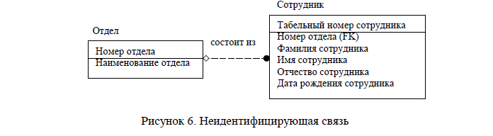

При установлении неидентифицирующей связи дочерняя сущность остается независимой, а атрибуты первичного ключа родительской сущности мигрируют в состав неключевых компонентов родительской сущности. Неидентифицирующая связь служит для связывания независимых сущностей. Экземпляр сущности Сотрудник может существовать безотносительно к какому-либо экземпляру сущности Отдел, т.е. Сотрудник может работать в организации, не числясь в каком-либо отделе.   

Во вкладке **General** меню **Relationship Editor** можно задать мощность, имя и тип связи.   

**Мощность связи** (Cardinality) – служит для обозначения отношения числа экземпляров родительской сущности к числу экземпляров дочерней.   

Можно использовать одну из четырех типов мощности: 
* Общий случай, когда одному экземпляру родительской сущности соответствует 0, 1 или много экземпляров дочерней сущности (не помечается каким-либо символом); 
* Одному экземпляру родительской сущности соответствует 1 или много экземпляров дочерней сущности (помечается символом Р); 
* Одному экземпляру родительской сущности соответствует 0 или 1 экземпляр дочерней сущности (помечается символом Z);   
* Одному экземпляру родительской сущности соответствует заранее заданное число экземпляров дочерней сущности (помечается цифрой точного соответствия). 

По умолчанию символ, обозначающий мощность связи, не показывается на диаграмме. Для отображения имени следует в контекстном меню для диаграммы (в месте не занятом объектами модели) выбрать пункт Display Options/Relationship и затем включить опцию Cardinality.   

**Имя связи** (Verb Phrase) – фраза, характеризующая отношение между родительской и дочерней сущностями. Для связи один-ко-многим идентифицирующей или неидентифицирующей достаточно указать имя, характеризующее отношение от родительской к дочерней сущности (Parent-to-Child). Для связи многие-ко-многим следует указывать имена как Parent-to Child так и Child-to-Parent.   

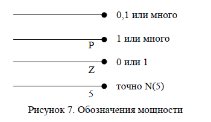

**Связь многие-ко-многим возможна только на логическом уровне.** При переходе к физическому уровню Erwin автоматически преобразует связь многие-ко-многим, добавляя новую таблицу и устанавливая две новые связи один-ко-многим от старых к новой таблице. Имя новой таблице присваивается автоматически как «Имя1_Имя2».   